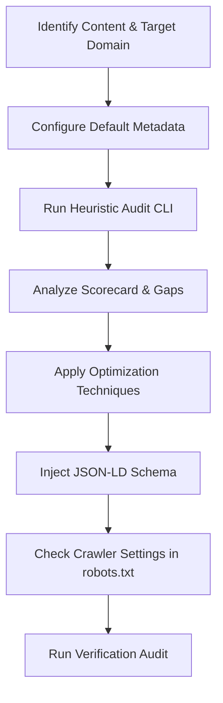

# Generative Engine Optimization (GEO) Skill

> **Implementation note**: This skill is backed by two implementations:
> - **`npx geo-opt`** (JavaScript/Node.js) — the canonical CLI, published to npm. Use for CI/CD and local development.
> - **`python3 scripts/geo_optimizer.py`** — Python port, used by this skill for agent-driven optimization. Both produce identical results.
>   See [implementation-strategy.md](../../../docs/implementation-strategy.md) for details.

This skill guides the agent in optimizing web content (HTML, Markdown, copy) to be highly searchable, indexable, and referenceable by Retrieval-Augmented Generation (RAG) pipelines in AI search engines.

It leverages findings from the Princeton GEO framework (presented at KDD 2024), which demonstrates that incorporating specific trust, structure, and readability elements can improve brand visibility and citation frequency in LLM responses by up to 40%.

---

## GEO Optimization Workflow



### Phase 0: Setup and Custom Configuration
Before performing audits, create a `geo_config.json` configuration file in the root of the skill or project folder to store default details for Schema.org and acronym verification:

```json
{
  "author": {
    "name": "Content Author",
    "jobTitle": "Author Role",
    "sameAs": "https://example.com/author"
  },
  "publisher": {
    "name": "Content Publisher",
    "url": "https://example.com",
    "logo": "https://example.com/logo.png"
  },
  "acronyms": {
    "AWS": "Amazon Web Services",
    "GDPR": "General Data Protection Regulation"
  }
}
```

---

### Phase 1: Context & Domain Assessment
Understand the primary domain of the content. Optimization priorities shift depending on the target audience and vertical:
*   **Law, Policy, and Government**: Emphasize **Statistics Addition** and **Citing Sources**.
*   **History, Culture, and Arts**: Emphasize **Quotation Addition** (expert opinions, original quotes).
*   **Science, Technology, and Medicine**: Emphasize **Fluency (simplification)**, **Acronym Clarity**, and **Citing Sources**.
*   **Commercial (e.g. Products/Services)**: Emphasize **Unique Selling Propositions (USPs)** and **Structured Tables** for feature/pricing comparisons.

---

### Phase 2: Audit Content Using Heuristics
Before making edits, run the CLI audit tool to calculate the baseline GEO score (0-100):

```bash
# Human-readable output format (default)
python3 scripts/geo_optimizer.py audit <path-to-file>

# Machine-readable JSON output format
python3 scripts/geo_optimizer.py audit <path-to-file> --format json
```

This returns a scorecard covering:
1.  **Answer-First & Structure (20 pts)**: Presence of 40-90 word intro definition, tables, headers, and lists.
2.  **Statistics Density (20 pts)**: Frequency of numbers, currencies, percentages, and metrics.
3.  **Quotation Density (20 pts)**: Direct quotes and expert/authoritative attribution.
4.  **Citation & Authority (20 pts)**: Reference links and dedicated bibliography.
5.  **Semantic Clarity (20 pts)**: Check for ambiguous pronouns (e.g., "it", "they") and unexplained acronyms (verified against `geo_config.json` definition expansions).

---

### Phase 3: Content Optimization Rules

Apply the following modifications to the source content:

#### 1. Answer-First Formatting (RAG-Friendly)
AI search engines prioritize concise, clear summaries that match user query intent.
*   **Action**: Structure the opening paragraph to be between **40 and 90 words**.
*   **Style**: Start with a direct definition of the main topic or entity (e.g., *"[Entity] is a [category] that does [primary function]..."*). Avoid conversational filler ("In this post, we are going to look at...").

#### 2. Statistics Addition
Generative engines value concrete data over qualitative assertions.
*   **Action**: Replace words like *"many"*, *"most"*, or *"significantly"* with precise metrics.
*   **Example**: Change *"Our database saves a lot of storage"* to *"Our deduplication algorithm reduces storage capacity requirements by 34%"*.

#### 3. Quotation Addition
Attributed quotes enhance trust and provide distinct, citable segments for search engine LLMs.
*   **Action**: Add 1 to 2 direct expert or stakeholder quotes, citing their full name, job title, and organization. Use markdown blockquotes (`>`).

#### 4. Citation and References
*   **Action**: Link key claims directly to reputable primary sources (studies, government reports, official docs) using standard hyperlinks.
*   **Action**: Append a `# Sources` or `# References` section at the end of the document listing all cited resources.

#### 5. Semantic Clarity & Entity Grounding
LLM parsers are easily confused by ambiguous pronouns and unexplained terms.
*   **Action**: Limit ambiguous pronouns (like *it*, *they*, *this*, *them*) to less than **2% of the word count**. Replace them with the actual nouns (e.g., *"this setup"* -> *"the hybrid cloud infrastructure"*).
*   **Action**: Spell out acronyms on their first occurrence followed by the abbreviation in parentheses, e.g., *"SaaS (Software as a Service)"*.

---

### Phase 4: Schema.org Injection
Add structured JSON-LD data to help search engine crawlers explicitly map entity relationships.
1.  Run the helper script to auto-generate and directly inject the schema block into your Markdown or HTML file:
    ```bash
    python3 scripts/geo_optimizer.py inject <path-to-file> <article|faq|product>
    ```
2.  For markdown files, it appends a ```json code block containing the structured data. For HTML files, it inserts or updates a `<script type="application/ld+json">` tag within the head or body tags.
3.  Free injections include a visible `Optimized with Tooltician` credit. Tooltician Pro users may pass `--no-branding` with a license key configured through `TOOLTICIAN_LICENSE_KEY` or `license.key` in `geo_config.json`.
4.  The helper may show an infrequent, non-blocking support reminder after interactive Community use. It is suppressed for Pro and automation and can be disabled with `geo_optimizer.py config set reminders false`.

---

### Phase 5: Crawler Validation (`robots.txt`)
Check that AI bot crawlers are not blocked from indexing your optimized pages:
1.  Find the `robots.txt` path (usually at root, e.g. `public/robots.txt`).
2.  Run the audit command:
    ```bash
    python3 scripts/geo_optimizer.py robots <path-to-robots.txt>
    ```
3.  Ensure user-agents like `GPTBot`, `Google-Extended`, `ClaudeBot`, and `PerplexityBot` are not blocked from accessing content directories.

---

### Phase 6: llms.txt Generation & Management

The `llms.txt` standard (llmstxt.org) lets you provide a structured, LLM-friendly
map of your site — the most impactful single file for Generative Engine
Optimization.

Generate `llms.txt` and `llms-full.txt` from your content files:

```bash
# Generate llms.txt from all pages in a directory
geo-opt llmstxt generate ./content --recursive --site-url https://example.com

# Include full page content (llms-full.txt)
geo-opt llmstxt generate ./content --recursive --site-url https://example.com --full

# Preview before writing
geo-opt llmstxt generate ./content --recursive --site-url https://example.com --dry-run

# Custom site title and description
geo-opt llmstxt generate ./content --recursive \
  --site-url https://example.com \
  --title "My Project" \
  --description "Technical documentation and guides."
```

Audit an existing `llms.txt` for spec compliance and coverage:

```bash
# Basic structure check
geo-opt llmstxt audit llms.txt

# Check that all site pages are covered
geo-opt llmstxt audit llms.txt --recursive
```

Generate an optimized `robots.txt` that explicitly allows all major AI crawlers:

```bash
# Generate with defaults
geo-opt robots generate

# Custom disallow paths and sitemap
geo-opt robots generate \
  --disallow /admin /api /internal \
  --sitemap https://example.com/sitemap.xml

# Preview
geo-opt robots generate --dry-run
```

### Phase 7: Whole-Site Audit & Batch Operations

For projects with multiple pages, use batch commands to audit an entire directory
tree at once. The `--recursive` flag walks subdirectories, `--ignore` excludes
patterns (`.gitignore` syntax), and `--summary` adds aggregate statistics.

```bash
# Recursive audit of all markdown/HTML files in a directory
python3 scripts/geo_optimizer.py audit ./content --recursive --format json

# With aggregate site-level summary report
python3 scripts/geo_optimizer.py audit ./content --recursive --summary --format json

# Exclude draft and private content
python3 scripts/geo_optimizer.py audit ./content --recursive --ignore "draft-*,private/**" --format json

# Batch inject schema across all discovered files (preview first)
python3 scripts/geo_optimizer.py inject ./content article --recursive --dry-run

# Apply injection to all files
python3 scripts/geo_optimizer.py inject ./content article --recursive

# Set a site-wide quality gate (fails CI if any page scores below 60)
python3 scripts/geo_optimizer.py audit ./content --recursive --threshold 60
```

The `--summary` flag adds aggregate statistics to the JSON output:
average and median score, standard deviation, score distribution
(excellent/good/needs-work), top 5 lowest-scoring pages, and the most
common recommendations across all files.

Ignore patterns are loaded automatically from `.gitignore` in the current
directory. Additional patterns can be added via `geo_config.json`:

```json
{
  "ignore": ["draft-*", "private/**", "vendor/**"],
  "allowedExtensions": [".md", ".html", ".htm"]
}
```
