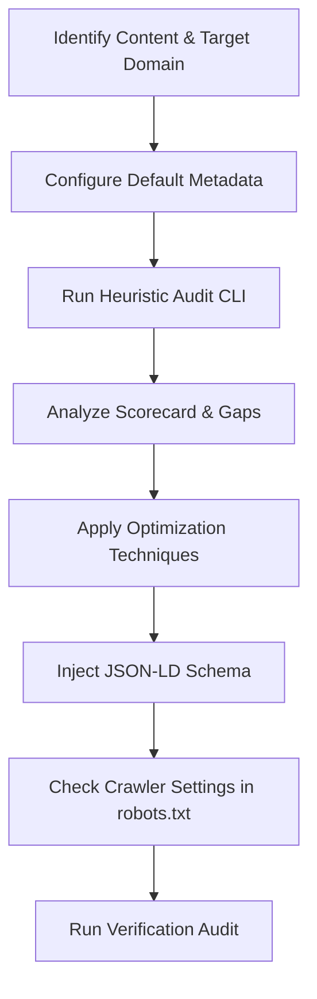

# Generative Engine Optimization (GEO) Skill

> **Implementation note**: This skill is backed by two implementations:
>
> - **`node bin/cli.js`** (JavaScript/Node.js) — the canonical source CLI. Use it for CI/CD and local development from a repository checkout. The public npm package has not been released.
> - **`python3 scripts/geo_optimizer.py`** — Python port, used by this skill for agent-driven optimization. Both produce identical results.
>   See [architecture.md](../../../docs/architecture.md) for details.

This skill guides the agent in optimizing web content (HTML, Markdown, copy) to be highly searchable, indexable, and referenceable by Retrieval-Augmented Generation (RAG) pipelines in AI search engines.

It draws on the [Princeton GEO research accepted at KDD 2024](https://arxiv.org/abs/2311.09735). The paper reports visibility gains of up to 40% in its experimental benchmark, with results varying by domain. The `geo-opt` score is an independent, uncalibrated heuristic; it does not reproduce that benchmark or predict outcomes in live AI products.

---

## GEO Optimization Workflow



### Phase 0: Setup and Custom Configuration

Before performing audits, create a `geo_config.json` configuration file in the root of the skill or project folder to store default details for Schema.org and acronym verification:

```json
{
  "author": {
    "name": "Content Author",
    "jobTitle": "Author Role",
    "sameAs": "https://example.com/author"
  },
  "publisher": {
    "name": "Content Publisher",
    "url": "https://example.com",
    "logo": "https://example.com/logo.png"
  },
  "acronyms": {
    "AWS": "Amazon Web Services",
    "GDPR": "General Data Protection Regulation"
  }
}
```

---

### Evidence levels

Each heuristic in this skill carries an **evidence label** that describes the
strength of support behind the recommendation. The label reflects the quality
and breadth of the underlying research, **not a guaranteed outcome** in any
specific AI search or retrieval product.

| Label                 | Meaning                                                                                                                                  |
| --------------------- | ---------------------------------------------------------------------------------------------------------------------------------------- |
| **Strong**            | Supported by multiple independent, reproducible studies and official platform documentation.                                             |
| **Probable**          | Supported by at least one controlled study or consistent platform guidance, but not yet replicated independently across engines.         |
| **Experimental**      | Supported by a single controlled benchmark under specific conditions; results may not transfer to live engines or different domains.     |
| **Project heuristic** | A reasonable practice derived from the project's own observations. No external study confirms a causal effect on AI search or retrieval. |

---

### Phase 1: Context & Domain Assessment

Understand the primary domain of the content. Optimization priorities shift depending on the target audience and vertical. Each domain suggestion below is a **project heuristic** unless a specific study is cited:

- **Law, Policy, and Government**: Emphasize **Statistics Addition** `[experimental]` and **Citing Sources** `[probable]`.
- **History, Culture, and Arts**: Emphasize **Quotation Addition** `[experimental]` (expert opinions, original quotes).
- **Science, Technology, and Medicine**: Emphasize **Fluency (simplification)** `[project heuristic]`, **Acronym Clarity** `[project heuristic]`, and **Citing Sources** `[probable]`.
- **Commercial (e.g. Products/Services)**: Emphasize **Unique Selling Propositions (USPs)** `[project heuristic]` and **Structured Tables** `[experimental]` for feature/pricing comparisons.

---

### Phase 2: Audit Content Using Heuristics

Before making edits, run the CLI audit tool to calculate the baseline GEO score (0-100):

```bash
# Human-readable output format (default)
python3 scripts/geo_optimizer.py audit <path-to-file>

# Machine-readable JSON output format
python3 scripts/geo_optimizer.py audit <path-to-file> --format json
```

This returns a scorecard covering five heuristic dimensions. Each dimension
carries an evidence label (see [Evidence levels](#evidence-levels) above):

1.  **Answer-First & Structure (20 pts)** `[experimental]`: Presence of a direct introductory definition, tables, headers, and lists.
2.  **Statistics Density (20 pts)** `[project heuristic]`: Frequency of numbers, currencies, percentages, and metrics.
3.  **Quotation Density (20 pts)** `[experimental]`: Direct quotes and expert/authoritative attribution.
4.  **Citation & Authority (20 pts)** `[probable]`: Reference links and dedicated bibliography.
5.  **Semantic Clarity (20 pts)** `[project heuristic]`: Check for ambiguous pronouns (e.g., "it", "they") and unexplained acronyms (verified against `geo_config.json` definition expansions).

---

### Phase 3: Content Optimization Rules

Apply the following modifications to the source content. Every rule carries an
evidence label (defined in [Evidence levels](#evidence-levels) above). The label
describes research support, not a guaranteed outcome.

**Important prohibitions (all evidence levels):**

- Do **not** invent statistics, data, or metrics to increase a score.
- Do **not** fabricate quotes, authorship, job titles, or affiliations.
- Do **not** restructure content solely to gain audit points at the expense of
  accuracy, readability, or user needs.
- Do **not** add references you have not verified.

#### 1. Answer-First Formatting (RAG-Friendly) `[experimental]`

The Princeton GEO benchmark observed that leading with a direct definition
correlated with higher visibility in its controlled setup. This has not been
replicated across live AI engines.

- **Heuristic**: Lead with a direct, self-contained definition of the main
  topic or entity (e.g., _"[Entity] is a [category] that does [primary
  function]..."_). Avoid conversational filler ("In this post, we are going to
  look at...").
- **Context check**: The appropriate length and structure depend on the
  audience, topic complexity, and domain. A compact opening (roughly 40–90
  words) was observed in one controlled benchmark; it is not a universal
  requirement.

#### 2. Statistics Addition `[project heuristic]`

Concrete, verifiable data can make claims more precise than qualitative
language alone. There is no independent study confirming that adding numbers
improves AI search visibility.

- **Heuristic**: Where accurate data is already available, prefer specific
  metrics over vague quantifiers ("many", "most", "significantly").
- **Example**: If your own measurements support it, _"Our deduplication
  algorithm reduces storage capacity requirements by 34%"_ is more precise
  than _"Our database saves a lot of storage"_.
- **Context check**: Only use data you can source and verify. If no
  measurement exists, qualitative description is preferable to invention.

#### 3. Quotation Addition `[experimental]`

The GEO paper observed a correlation between attributed quotes and visibility
in its benchmark. Quotes may also help retrieval systems surface distinct
viewpoints, but there is no evidence that a specific number of quotes improves
outcomes in live AI products.

- **Heuristic**: Where relevant, include attributed quotes from named
  sources with verifiable credentials (full name, role, organization). Use
  markdown blockquotes (`>`).
- **Context check**: Add quotes when they strengthen the content's
  authority or provide genuine expert perspective. Do not add quotes solely
  to meet a quota. Unsourced or invented quotes damage credibility and may
  violate platform policies.

#### 4. Citation and References `[probable]`

Linking claims to primary sources is consistent with general information
quality guidance across multiple platforms. "What Gets Cited"
(arXiv:2605.25517) found relevance and source position stronger than
formatting-only changes in its controlled setup.

- **Heuristic**: Link key claims directly to reputable primary sources
  (studies, government reports, official documentation) using standard
  hyperlinks.
- **Heuristic**: Consider a `# Sources` or `# References` section listing
  cited resources.
- **Context check**: Cite sources you have reviewed. Prefer primary sources
  over secondary summaries. Do not add citations to irrelevant or unverified
  material.

#### 5. Semantic Clarity & Entity Grounding `[project heuristic]`

Clear entity references may help language models resolve meaning, but no
external study has established a causal link between pronoun density and AI
search performance.

- **Heuristic**: Prefer explicit nouns over ambiguous pronouns (_it_, _they_,
  _this_, _them_) where clarity is at risk. Replace vague references with the
  actual entity name (e.g., _"the hybrid cloud infrastructure"_ instead of
  _"this setup"_).
- **Heuristic**: Spell out acronyms on first occurrence followed by the
  abbreviation in parentheses, e.g., _"SaaS (Software as a Service)"_.
- **Context check**: Pronoun use is natural in many writing styles. A fixed
  percentage threshold (such as 2%) is a project-internal benchmark
  convention, not a platform requirement. Prioritize readability and
  audience expectations over mechanical substitution.

---

### Phase 4: Schema.org Injection

Structured data via JSON-LD helps search engines understand entity
relationships on a page. Schema.org markup is useful for supported Google
Search features (articles, FAQs, products, breadcrumbs) but is **not** a
special GEO ranking mechanism. Google's own guidance states there is no
special schema for AI optimization
([AI optimization guide](https://developers.google.com/search/docs/fundamentals/ai-optimization-guide)).

Note: Google retired the FAQ rich result in June 2026. `FAQ` Schema.org markup
remains valid for other purposes, but it no longer triggers that specific
Search feature.

1.  Run the helper script to auto-generate and directly inject the schema block into your Markdown or HTML file:
    ```bash
    python3 scripts/geo_optimizer.py inject <path-to-file> <article|faq|product>
    ```
2.  For markdown files, it appends a ```json code block containing the structured data. For HTML files, it inserts or updates a `<script type="application/ld+json">` tag within the head or body tags.
3.  Free injections include a visible `Optimized with Tooltician` credit. Tooltician Pro users may pass `--no-branding` with a license key configured through `TOOLTICIAN_LICENSE_KEY` or `license.key` in `geo_config.json`.
4.  The helper may show an infrequent, non-blocking support reminder after interactive Community use. It is suppressed for Pro and automation and can be disabled with `geo_optimizer.py config set reminders false`.

---

### Phase 5: Crawler Validation (`robots.txt`)

Check that AI bot crawlers are not blocked from indexing your optimized pages:

1.  Find the `robots.txt` path (usually at root, e.g. `public/robots.txt`).
2.  Run the audit command:
    ```bash
    python3 scripts/geo_optimizer.py robots <path-to-robots.txt>
    ```
3.  Review whether the site's intended policy allows or blocks each relevant
    agent. Search, training, and user-directed agents have different purposes;
    do not treat `GPTBot`, `OAI-SearchBot`, `Google-Extended`, `ClaudeBot`,
    `Claude-SearchBot`, and `PerplexityBot` as interchangeable.

---

### Phase 6: llms.txt Generation & Management

The [`llms.txt` community proposal](https://llmstxt.org/) defines a structured,
LLM-friendly map of a site. It is an inference-time convenience for tools that
choose to consume it, not a formal web standard. Google Search does not use
`llms.txt` for ranking or indexing. It complements rather than replaces
accessible HTML, sitemaps, `robots.txt`, and structured data.

Generate `llms.txt` and `llms-full.txt` from your content files:

```bash
# Generate llms.txt from all pages in a directory
node bin/cli.js llmstxt generate ./content --recursive --site-url https://example.com

# Include full page content (llms-full.txt)
node bin/cli.js llmstxt generate ./content --recursive --site-url https://example.com --full

# Preview before writing
node bin/cli.js llmstxt generate ./content --recursive --site-url https://example.com --dry-run

# Custom site title and description
node bin/cli.js llmstxt generate ./content --recursive \
  --site-url https://example.com \
  --title "My Project" \
  --description "Technical documentation and guides."
```

Audit an existing `llms.txt` for spec compliance and coverage:

```bash
# Basic structure check
node bin/cli.js llmstxt audit llms.txt

# Check that all site pages are covered
node bin/cli.js llmstxt audit llms.txt --recursive
```

Generate a reviewable `robots.txt` draft that allows the agents in the current
registry. Confirm that those permissions match the site's search, training,
privacy, and security policy before publishing:

```bash
# Generate with defaults
node bin/cli.js robots generate

# Custom disallow paths and sitemap
node bin/cli.js robots generate \
  --disallow /admin /api /internal \
  --sitemap https://example.com/sitemap.xml

# Preview
node bin/cli.js robots generate --dry-run
```

### Phase 7: Whole-Site Audit & Batch Operations

For projects with multiple pages, use batch commands to audit an entire directory
tree at once. The `--recursive` flag walks subdirectories, `--ignore` excludes
patterns (`.gitignore` syntax), and `--summary` adds aggregate statistics.

```bash
# Recursive audit of all markdown/HTML files in a directory
python3 scripts/geo_optimizer.py audit ./content --recursive --format json

# With aggregate site-level summary report
python3 scripts/geo_optimizer.py audit ./content --recursive --summary --format json

# Exclude draft and private content
python3 scripts/geo_optimizer.py audit ./content --recursive --ignore "draft-*,private/**" --format json

# Batch inject schema across all discovered files (preview first)
python3 scripts/geo_optimizer.py inject ./content article --recursive --dry-run

# Apply injection to all files
python3 scripts/geo_optimizer.py inject ./content article --recursive

# Set a site-wide quality gate (fails CI if any page scores below 60)
python3 scripts/geo_optimizer.py audit ./content --recursive --threshold 60
```

The `--summary` flag adds aggregate statistics to the JSON output:
average and median score, standard deviation, score distribution
(excellent/good/needs-work), top 5 lowest-scoring pages, and the most
common recommendations across all files.

Ignore patterns are loaded automatically from `.gitignore` in the current
directory. Additional patterns can be added via `geo_config.json`:

```json
{
  "ignore": ["draft-*", "private/**", "vendor/**"],
  "allowedExtensions": [".md", ".html", ".htm"]
}
```

### Profile-aware auditing (v2, experimental)

The v2 scoring model (`--model v2`) adjusts expectations based on content type:

```bash
# Auto-detect profile
geo-opt audit ./docs --model v2

# Explicit profile override
python3 scripts/geo_optimizer.py audit ./docs --model v2 --profile documentation
```

Available profiles: `auto` (default), `documentation`, `open-source`,
`editorial`, `commercial`, `ecommerce`, `regulated`.

**What profiles change:**

- `documentation` and `open-source`: not penalized for lacking expert
  quotations or marketing statistics.
- `regulated`: not penalized for lacking quotes; prioritizes dated
  authorship and authoritative sources.
- `editorial`: all five dimensions (structure, statistics, quotations,
  citations, clarity) are evaluated.
- `commercial` and `ecommerce`: customer testimonials and product
  specifications are treated as valid evidence.

**Readiness bands** replace the 0–100 score in v2 output:

- **Production-Ready** (≥85 %) — well-structured, well-attributed, clear.
- **Solid** (65–84 %) — meets most quality thresholds.
- **Needs Work** (45–64 %) — structural or attribution gaps.
- **At Risk** (<45 %) — multiple quality issues.

Set `profile` in `geo_config.json` to lock a profile for all audits:

```json
{
  "profile": "documentation"
}
```
