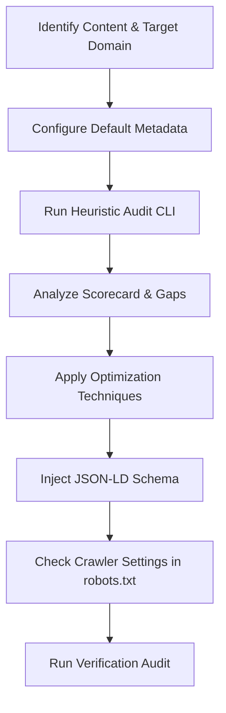

# Generative Engine Optimization (GEO) Skill

This skill guides the agent in optimizing web content (HTML, Markdown, copy) to be highly searchable, indexable, and referenceable by Retrieval-Augmented Generation (RAG) pipelines in AI search engines.

It leverages findings from the Princeton GEO framework (presented at KDD 2024), which demonstrates that incorporating specific trust, structure, and readability elements can improve brand visibility and citation frequency in LLM responses by up to 40%.

---

## GEO Optimization Workflow



### Phase 0: Setup and Custom Configuration
Before performing audits, create a `geo_config.json` configuration file in the root of the skill or project folder to store default details for Schema.org and acronym verification:

```json
{
  "author": {
    "name": "Carlos Ortega González",
    "jobTitle": "Sr. Software Automation and Data Analyst",
    "sameAs": "https://www.linkedin.com/in/cortega26/"
  },
  "publisher": {
    "name": "Tooltician",
    "url": "https://www.tooltician.com",
    "logo": "https://www.tooltician.com/logo.png"
  },
  "acronyms": {
    "AWS": "Amazon Web Services",
    "GDPR": "General Data Protection Regulation"
  }
}
```

---

### Phase 1: Context & Domain Assessment
Understand the primary domain of the content. Optimization priorities shift depending on the target audience and vertical:
*   **Law, Policy, and Government**: Emphasize **Statistics Addition** and **Citing Sources**.
*   **History, Culture, and Arts**: Emphasize **Quotation Addition** (expert opinions, original quotes).
*   **Science, Technology, and Medicine**: Emphasize **Fluency (simplification)**, **Acronym Clarity**, and **Citing Sources**.
*   **Commercial (e.g. Products/Services)**: Emphasize **Unique Selling Propositions (USPs)** and **Structured Tables** for feature/pricing comparisons.

---

### Phase 2: Audit Content Using Heuristics
Before making edits, run the CLI audit tool to calculate the baseline GEO score (0-100):

```bash
# Human-readable output format (default)
python3 scripts/geo_optimizer.py audit <path-to-file>

# Machine-readable JSON output format
python3 scripts/geo_optimizer.py audit <path-to-file> --format json
```

This returns a scorecard covering:
1.  **Answer-First & Structure (20 pts)**: Presence of 40-90 word intro definition, tables, headers, and lists.
2.  **Statistics Density (20 pts)**: Frequency of numbers, currencies, percentages, and metrics.
3.  **Quotation Density (20 pts)**: Direct quotes and expert/authoritative attribution.
4.  **Citation & Authority (20 pts)**: Reference links and dedicated bibliography.
5.  **Semantic Clarity (20 pts)**: Check for ambiguous pronouns (e.g., "it", "they") and unexplained acronyms (verified against `geo_config.json` definition expansions).

---

### Phase 3: Content Optimization Rules

Apply the following modifications to the source content:

#### 1. Answer-First Formatting (RAG-Friendly)
AI search engines prioritize concise, clear summaries that match user query intent.
*   **Action**: Structure the opening paragraph to be between **40 and 90 words**.
*   **Style**: Start with a direct definition of the main topic or entity (e.g., *"[Entity] is a [category] that does [primary function]..."*). Avoid conversational filler ("In this post, we are going to look at...").

#### 2. Statistics Addition
Generative engines value concrete data over qualitative assertions.
*   **Action**: Replace words like *"many"*, *"most"*, or *"significantly"* with precise metrics.
*   **Example**: Change *"Our database saves a lot of storage"* to *"Our deduplication algorithm reduces storage capacity requirements by 34%"*.

#### 3. Quotation Addition
Attributed quotes enhance trust and provide distinct, citable segments for search engine LLMs.
*   **Action**: Add 1 to 2 direct expert or stakeholder quotes, citing their full name, job title, and organization. Use markdown blockquotes (`>`).

#### 4. Citation and References
*   **Action**: Link key claims directly to reputable primary sources (studies, government reports, official docs) using standard hyperlinks.
*   **Action**: Append a `# Sources` or `# References` section at the end of the document listing all cited resources.

#### 5. Semantic Clarity & Entity Grounding
LLM parsers are easily confused by ambiguous pronouns and unexplained terms.
*   **Action**: Limit ambiguous pronouns (like *it*, *they*, *this*, *them*) to less than **2% of the word count**. Replace them with the actual nouns (e.g., *"this setup"* -> *"the hybrid cloud infrastructure"*).
*   **Action**: Spell out acronyms on their first occurrence followed by the abbreviation in parentheses, e.g., *"SaaS (Software as a Service)"*.

---

### Phase 4: Schema.org Injection
Add structured JSON-LD data to help search engine crawlers explicitly map entity relationships.
1.  Run the helper script to auto-generate and directly inject the schema block into your Markdown or HTML file:
    ```bash
    python3 scripts/geo_optimizer.py inject <path-to-file> <article|faq|product>
    ```
2.  For markdown files, it appends a ```json code block containing the structured data. For HTML files, it inserts or updates a `<script type="application/ld+json">` tag within the head or body tags.

---

### Phase 5: Crawler Validation (`robots.txt`)
Check that AI bot crawlers are not blocked from indexing your optimized pages:
1.  Find the `robots.txt` path (usually at root, e.g. `public/robots.txt`).
2.  Run the audit command:
    ```bash
    python3 scripts/geo_optimizer.py robots <path-to-robots.txt>
    ```
3.  Ensure user-agents like `GPTBot`, `Google-Extended`, `ClaudeBot`, and `PerplexityBot` are not blocked from accessing content directories.
