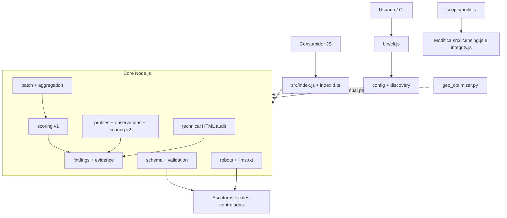

# Auditoría integral de arquitectura de `geo-opt`

**Fecha:** 2026-06-27
**Commit auditado:** `f91fae7`
**Profundidad:** repositorio completo, read-only
**Enfoque:** evolución pragmática para un único desarrollador asistido por IA

> **Reconciliation note — 2026-06-27:** the recommendations in this dated
> report are now represented by executable plans 029–034 and ordered in
> `plans/README.md`. One dependency statement was corrected below:
> `scripts/requirements.txt` exists; CI bypasses it rather than the repository
> lacking a declaration.

## Veredicto ejecutivo

`geo-opt` va por un camino razonable y no necesita una reescritura. El núcleo
Node.js ya tiene separaciones útiles, procesamiento local, dependencias
moderadas, analizadores mayormente puros y una base de pruebas superior a la
esperable para su tamaño.

La recomendación es **continuar con una corrección de rumbo antes del primer
release público**:

1. no promover v2 a modelo por defecto ni publicar npm mientras su contrato de
   findings, versionado y tipos siga incompleto;
2. convertir Node.js en una fuente canónica real, con un contrato de resultados
   común y una definición explícita —más estrecha— de la paridad Python;
3. separar definitivamente el core que retorna datos de los adaptadores que
   imprimen, escriben archivos o terminan procesos;
4. construir el artefacto de publicación fuera de `src/`, sin restaurar fuentes
   mediante Git;
5. automatizar tipos, paridad, runtimes y release como contratos verificables.

No recomiendo microservicios, monorepo, reescritura TypeScript, sistema de
plugins ni plataforma alojada en esta etapa. La deuda principal no es de escala:
es de **contratos y duplicación de superficies**.

### Decisión recomendada

Adoptar **núcleo canónico Node.js + contratos estables + adaptadores delgados**.
Mantener Python sólo con un alcance de compatibilidad explícito y probado; no
seguir prometiendo identidad total entre runtimes hasta que exista.

### Gates antes de publicar

- Todos los findings v2 cumplen un único esquema validado.
- v1 y v2 poseen identificadores de modelo inequívocos.
- `scoreContentV2` y su reporte están incluidos y verificados en los tipos.
- `npm pack` o el flujo equivalente inspecciona exactamente el artefacto que se
  publicará.
- CI deja de usar Node.js 20, actualmente EOL.
- La documentación no anuncia comandos Python que el parser rechaza.

## Línea base verificada

| Señal                    | Resultado                                 |
| ------------------------ | ----------------------------------------- |
| JavaScript               | 19 módulos en `src/`; ESM; Node.js        |
| Python                   | Un port CLI de 2.609 líneas               |
| CLI Node                 | 858 líneas                                |
| Código y pruebas medidos | 14.238 líneas en los archivos principales |
| Tests JavaScript         | 198/198 exitosos                          |
| Tests Python             | 35/35 exitosos                            |
| Cobertura JavaScript     | 90,63 % statements; 82,02 % branches      |
| Dependencias npm         | 0 vulnerabilidades conocidas              |
| Paquete dry-run          | 30 archivos; 80.111 bytes comprimidos     |
| Verificación completa    | `npm run check`: exit 0                   |
| Whitespace               | `git diff --check`: sin salida            |

La cobertura global es saludable, pero oculta puntos relevantes:

- `src/validate.js`: 11,6 % de statements y 0 % de funciones;
- `src/integrity.js`: 20 % de branches y 0 % de funciones;
- `bin/cli.js`: 57,92 % de branches;
- Python no tiene medición de cobertura;
- lint termina con éxito aunque mantiene seis warnings.

## Arquitectura actual



### Complejidad justificada

- Separar observación, scoring y evidencia es correcto para un heurístico que
  necesita evolucionar sin confundir hechos observados con recomendaciones.
- Mantener v1 temporalmente es razonable mientras v2 sigue experimental.
- La auditoría técnica merece permanecer separada del scoring editorial.
- El uso de I/O síncrono es apropiado para un CLI local de archivos pequeños o
  medianos: simplifica el control de errores sin introducir un cuello de botella
  demostrado.
- Las protecciones de symlinks, dry-run y backups añaden robustez real.

### Deuda accidental

- El contrato v2 se construye por dos caminos incompatibles.
- v1 y v2 duplican la orquestación batch y no tienen identidad de versión
  consistente.
- Python replica comportamiento en un monolito y ya quedó detrás de la
  documentación.
- La API pública exporta más internals de los que el proyecto puede mantener con
  comodidad.
- Varias funciones públicas mezclan core, presentación y `process.exit`.
- El artefacto de publicación se crea modificando fuentes versionadas.

## Evaluación por atributo

Escala: 1 = débil, 3 = aceptable con deuda, 5 = sólido.

| Atributo                        |  Nota | Evaluación                                                                       |
| ------------------------------- | ----: | -------------------------------------------------------------------------------- |
| Estabilidad                     |   3/5 | Tests fuertes, pero contratos v2 y tipos todavía divergen.                       |
| Mantenibilidad                  |   3/5 | Node está modularizado; Python, CLI y dos modelos elevan el coste de cambio.     |
| Robustez                        |   3/5 | Buenas defensas de escritura; core público aún puede terminar el proceso host.   |
| Claridad                        |   3/5 | Nombres y documentación son buenos; versionado y paridad prometida son ambiguos. |
| Eficiencia                      |   4/5 | Diseño local y síncrono adecuado; no hay problemas algorítmicos relevantes.      |
| Automatización                  |   3/5 | CI y coverage son buenos; faltan gates de tipos, paridad, warnings y artefacto.  |
| Adecuación a un solo mantenedor |   3/5 | Viable hoy, pero la duplicación crecerá más rápido que el producto.              |
| Preparación a 12–24 meses       | 2,5/5 | Necesita estabilizar contratos antes de añadir monitoring o integraciones.       |

## Hallazgos priorizados

| #   | Hallazgo                                             | Categoría               | Impacto    | Esfuerzo | Riesgo del cambio | Confianza |
| --- | ---------------------------------------------------- | ----------------------- | ---------- | -------- | ----------------- | --------- |
| 1   | Normalizar el contrato de findings v2                | Correctness / API       | Alto       | M        | Medio             | Alta      |
| 2   | Unificar el motor de auditoría y el versionado v1/v2 | Arquitectura            | Alto       | M        | Medio             | Alta      |
| 3   | Redefinir la paridad Python según capacidad real     | Arquitectura / Docs     | Alto       | M–L      | Medio             | Alta      |
| 4   | Separar core puro de CLI, rendering y `process.exit` | Arquitectura / Robustez | Alto       | M        | Medio             | Alta      |
| 5   | Verificar automáticamente API pública y tipos        | API / DX                | Alto       | S–M      | Bajo              | Alta      |
| 6   | Crear el paquete sin modificar fuentes versionadas   | Release / Robustez      | Alto       | M        | Medio             | Alta      |
| 7   | Salir de Node.js 20 y declarar dependencias Python   | Dependencias / CI       | Medio–Alto | S        | Bajo              | Alta      |
| 8   | Cerrar brechas de validación y quality gates         | Tests / Tooling         | Medio      | S–M      | Bajo              | Alta      |
| 9   | Evitar que una auditoría v2 cuente como inyección    | Correctness             | Medio      | S        | Bajo              | Alta      |
| 10  | Reconciliar planes implementados con su estado       | DX / Gobernanza         | Medio      | S        | Bajo              | Alta      |

## Hallazgos detallados

### [CORRECTNESS-01] Normalizar todos los findings v2

- **Evidencia:** `src/scoring-v2.js:27-31` declara findings reducidos a
  `ruleId`, `status` y `message`; los scorers los producen así desde
  `src/scoring-v2.js:45-56`.
- **Evidencia:** `src/findings.js:59-69` espera `category` y `severity`, pero
  `mapObservationsToFindings` llama `createFinding` con `status` y sin
  `category` en `src/findings.js:477-488` y los bloques equivalentes.
- **Evidencia:** `src/scoring-v2.js:548` concatena findings reducidos y
  `src/scoring-v2.js:612` los mezcla con los findings del bridge.
- **Evidencia:** `src/batch.js:88-100` agrega por `severity`, `category` y
  `evidenceLabel`, campos ausentes en parte de los resultados v2.
- **Evidencia:** `tests/scoring-v2.test.js:190-198` comprueba sólo un `ruleId`;
  `tests/scoring-v2.test.js:266-280` comprueba que `findings` sea un array, no
  que cumpla el contrato.
- **Impacto:** el JSON v2 es parseable pero no estable. `topFindings` omite
  categorías y evidencia, y consumidores tipados reciben objetos que no
  satisfacen `Finding`. La promesa de findings versionados no es verdadera.
- **Esfuerzo:** M.
- **Riesgo:** MEDIO; corregir la forma puede afectar snapshots o consumidores
  experimentales.
- **Confianza:** ALTA; reproducido ejecutando un summary v2.
- **Corrección sugerida:** construir todo finding mediante una única factory
  validada. Si los scorers necesitan diagnósticos internos reducidos, mantenerlos
  fuera del reporte y normalizarlos antes de publicar. Añadir contract tests
  para cada elemento y para `aggregateReport`.

### [ARCH-01] Unificar la orquestación y la identidad de los modelos

- **Evidencia:** `bin/cli.js:254-318` implementa un loop batch, output,
  threshold y errores exclusivo para v2.
- **Evidencia:** `bin/cli.js:320-395` contiene un segundo workflow para v1;
  `src/batch.js:17-38` está acoplado directamente a `scoreContent`.
- **Evidencia:** `src/findings.js:16-17` define `MODEL_VERSION = "2.0.0"` para
  todo el proyecto y `src/scoring.js:428-432` lo incorpora también en reportes
  v1. `src/scoring-v2.js:574-577` vuelve a fijar `"2.0.0"`.
- **Evidencia:** un reporte v1 ejecutado durante la auditoría devolvió
  `modelVersion: "2.0.0"`.
- **Impacto:** no se puede identificar de forma fiable qué algoritmo produjo un
  reporte persistido. Cada nueva opción debe implementarse dos veces en el CLI y
  es fácil que thresholds, summaries o errores diverjan.
- **Esfuerzo:** M.
- **Riesgo:** MEDIO; toca la ruta principal y compatibilidad de JSON.
- **Confianza:** ALTA.
- **Corrección sugerida:** introducir un contrato interno pequeño de motor
  (`score(content, context) -> AuditResult`) seleccionado por `model`. Reusar una
  sola ruta batch, threshold y serialización. Versionar por separado paquete,
  contrato de reporte y modelo de scoring.

### [ARCH-02] Convertir la paridad Python en un tier explícito

- **Evidencia:** `docs/architecture.md:3-7` exige alineación funcional y
  `docs/architecture.md:43-58` incluye scoring y reportes en el contrato.
- **Evidencia:** `.agents/skills/geo-optimization/SKILL.md:13-17` afirma que
  ambos runtimes producen resultados idénticos.
- **Evidencia:** `.agents/skills/geo-optimization/SKILL.md:340-350` documenta
  `python3 ... --model v2 --profile documentation`.
- **Evidencia:** el parser Python en
  `.agents/skills/geo-optimization/scripts/geo_optimizer.py:2231-2238` no
  declara `--model` ni `--profile`; el comando documentado fue rechazado durante
  la auditoría.
- **Evidencia:** el único test cross-runtime compara una fixture v1 en
  `.agents/skills/geo-optimization/scripts/test_optimizer.py:157-201`.
- **Impacto:** cada feature obliga a sincronizar dos implementaciones, pero las
  pruebas actuales sólo detectan una fracción de la deriva. Para un mantenedor,
  este coste compite directamente con producto, calibración y soporte.
- **Esfuerzo:** M para definir el tier y una matriz golden mínima; L si se decide
  portar v2 y technical audit completos.
- **Riesgo:** MEDIO; reducir el alcance puede afectar entornos que dependan de
  Python, aunque todavía no hay evidencia de uso público.
- **Confianza:** ALTA.
- **Corrección sugerida:** declarar inmediatamente qué comandos son equivalentes
  y cuáles son Node-only. Compartir fixtures y comparar JSON normalizado para
  las capacidades comprometidas. No portar nuevas superficies hasta medir si
  Python resuelve una restricción de despliegue real.

### [ARCH-03] Separar funciones de dominio y adaptadores de proceso

- **Evidencia:** `src/config.js:58-100` imprime y llama `process.exit` desde
  `loadConfig`, exportado como API pública.
- **Evidencia:** `src/scoring.js:438-469`, `src/validate.js:13-48` y
  `src/robots.js:330-352` mezclan lectura, rendering y terminación del proceso.
- **Evidencia:** `src/schema.js:51-101` ofrece una validación que retorna datos,
  pero otras funciones exportadas hacen `process.exit`; `generateSchemaData`
  también termina el proceso en `src/schema.js:107-130`.
- **Evidencia:** `src/batch.js:144-195` replica parte del workflow de inyección
  para evitar los exits del flujo individual.
- **Impacto:** una librería embebida puede terminar la aplicación consumidora.
  Batch y CLI necesitan caminos alternativos, aumentando duplicación y pruebas.
- **Esfuerzo:** M.
- **Riesgo:** MEDIO; deben preservarse códigos de salida y mensajes del CLI.
- **Confianza:** ALTA.
- **Corrección sugerida:** las funciones de dominio retornan resultados o lanzan
  errores tipados; sólo `bin/cli.js` decide stderr, exit code y formato. Mantener
  wrappers compatibles durante una transición si son necesarios.

### [API-01] Hacer verificable la superficie pública

- **Evidencia:** `src/index.js:53` exporta `scoreContentV2`, pero
  `index.d.ts` no contiene esa función ni un tipo de reporte v2.
- **Evidencia:** `package.json:5-6` publica `src/index.js` junto a un
  `index.d.ts` manual de 648 líneas.
- **Evidencia:** `package.json:23-32` no incluye typecheck, generación de
  declaraciones ni un consumer test TypeScript.
- **Evidencia:** `src/index.js:1-75` expone también licensing, engagement,
  asserts de filesystem, observaciones y registries internos.
- **Impacto:** el paquete puede pasar todos los checks y publicar JavaScript que
  sus propios tipos niegan o describen incorrectamente. La superficie amplia
  multiplica el compromiso de compatibilidad futura.
- **Esfuerzo:** S–M.
- **Riesgo:** BAJO antes del primer release; mayor después.
- **Confianza:** ALTA.
- **Corrección sugerida:** definir un facade soportado pequeño, usar `exports`
  para controlar subpaths y añadir un consumer fixture que compile imports
  públicos. Generar declaraciones desde JSDoc o validarlas contra los exports,
  sin requerir una reescritura TypeScript.

### [RELEASE-01] Construir en staging, no sobre `src/`

- **Evidencia:** `scripts/build.js:11-35` lee y reemplaza
  `src/licensing.js` con código ofuscado.
- **Evidencia:** `scripts/build.js:37-47` reemplaza el placeholder dentro de
  `src/integrity.js`.
- **Evidencia:** `package.json:33-34` ejecuta el build en `prepublishOnly` y
  después restaura con `git checkout --`.
- **Evidencia:** la documentación oficial de npm establece que
  `prepublishOnly` se ejecuta sólo en `npm publish`; `npm pack` usa
  `prepack/postpack`. Por tanto, el dry-run actual no inspecciona el artefacto
  transformado.
- **Impacto:** un publish fallido puede dejar fuentes modificadas. El
  `postpublish` puede descartar cambios locales concurrentes. El paquete
  revisado por `npm pack --dry-run` no es necesariamente el que se publica.
- **Esfuerzo:** M.
- **Riesgo:** MEDIO; cambia la composición del paquete y la verificación de
  integridad.
- **Confianza:** ALTA.
- **Corrección sugerida:** producir `dist/` o un directorio temporal, aplicar
  allí cualquier transformación, empaquetar ese contenido y verificar el
  tarball exacto. El proceso no debe requerir Git para restaurar estado.

### [DEPS-01] Modernizar runtimes y declarar Python

- **Evidencia:** `package.json:36-38` acepta Node.js 20 y
  `.github/workflows/ci.yml:23-27` prueba únicamente Node.js 20.
- **Evidencia:** Node.js marca v20 como EOL desde 2026-03-24; v22 y v24 se
  mantienen como LTS.
- **Evidencia:** `.github/workflows/ci.yml:41-52` instala Python 3.11 y
  `mistune`/`beautifulsoup4` directamente, sin consumir la declaración del
  port.
- **Evidencia:**
  `.agents/skills/geo-optimization/scripts/requirements.txt` existe con límites
  mínimos, pero CI no lo usa y no define límites superiores ante futuros
  cambios mayores.
- **Impacto:** CI valida una runtime sin parches futuros, mientras una nueva
  resolución Python puede romper el build sin cambios del repositorio.
- **Esfuerzo:** S.
- **Riesgo:** BAJO; el paquete npm aún no fue publicado.
- **Confianza:** ALTA.
- **Corrección sugerida:** establecer Node.js `>=22`, probar 22 y 24, y declarar
  las dependencias Python con rangos compatibles. Añadir al menos dos versiones
  Python soportadas si se mantiene el tier.

### [TEST-01] Convertir cobertura y lint en gates de riesgo

- **Evidencia:** `src/validate.js:13-112` contiene todo el comando de validación,
  pero no aparece en los tests y obtuvo 11,6 % de cobertura.
- **Evidencia:** `src/integrity.js:20-40` contiene la degradación por tampering,
  pero la cobertura reportó 0 % de funciones.
- **Evidencia:** `package.json:27` ejecuta ESLint sin `--max-warnings=0`;
  `eslint.config.js:26` configura unused vars como warning.
- **Evidencia:** el check pasó con seis warnings, incluyendo imports y cálculos
  sin uso en v2.
- **Impacto:** la cifra global verde esconde dos caminos públicos/release sin
  caracterización y tolera restos de implementación que un agente puede
  interpretar como diseño vigente.
- **Esfuerzo:** S–M.
- **Riesgo:** BAJO.
- **Confianza:** ALTA.
- **Corrección sugerida:** añadir tests de comportamiento para validation e
  integrity, limpiar el baseline y hacer fatal cualquier warning nuevo. Usar
  thresholds por módulo crítico, no perseguir 100 % global.

### [CORRECTNESS-02] No registrar auditorías como inyecciones

- **Evidencia:** `bin/cli.js:315-316` llama
  `recordSuccessfulFreeInjection(config)` al terminar una auditoría v2.
- **Evidencia:** `src/engagement.js:13-18` persiste
  `successfulFreeInjections`; `src/engagement.js:88-126` incrementa ese contador
  y eventualmente muestra el recordatorio comercial.
- **Evidencia:** la llamada legítima después de una inyección está en
  `bin/cli.js:763-765`.
- **Impacto:** sólo las auditorías v2 alteran estado de engagement y pueden
  activar un recordatorio concebido para inyecciones. v1 y v2 tienen efectos
  laterales distintos sin razón de dominio.
- **Esfuerzo:** S.
- **Riesgo:** BAJO.
- **Confianza:** ALTA.
- **Corrección sugerida:** retirar la llamada del audit o introducir un evento
  de engagement con semántica explícita y pruebas CLI.

### [DX-01] Reconciliar código, changelog y registro de planes

- **Evidencia:** `plans/README.md:37-38` mantiene 022 y 023 como `PENDING`.
- **Evidencia:** `CHANGELOG.md:12-34` declara implementados technical audit, v2
  y el bridge de findings.
- **Evidencia:** existen `src/scoring-v2.js`, `src/observations.js`,
  `src/profiles.js` y `src/technical.js`, con tests activos.
- **Impacto:** un agente puede volver a implementar trabajo existente o seguir
  prerequisitos incorrectos. En un proyecto de una persona, el plan index es
  memoria operativa y debe ser confiable.
- **Esfuerzo:** S.
- **Riesgo:** BAJO.
- **Confianza:** ALTA.
- **Corrección sugerida:** marcar 022 y 023 como parciales o reconciliarlos
  contra sus done criteria; archivar sólo cuando todos sus contratos estén
  satisfechos.

## Alternativas arquitectónicas

| Alternativa                                  | Ventajas                                                                  | Costes / riesgos                                               | Mediano plazo                         | Largo plazo                           | Veredicto               |
| -------------------------------------------- | ------------------------------------------------------------------------- | -------------------------------------------------------------- | ------------------------------------- | ------------------------------------- | ----------------------- |
| Mantener la forma actual                     | Cero migración inmediata; máxima continuidad                              | Duplicación v1/v2/Python, tipos manuales, dos paths CLI        | Cada feature cuesta más y deriva más  | Difícil sostener Pro/monitoring solo  | No recomendada          |
| Core Node canónico + contratos + adaptadores | Conserva producto y reduce duplicación; permite CLI, API y Python acotado | Requiere una consolidación M y disciplina de contratos         | Feedback rápido y cambios localizados | Buena base para reportes o monitoring | **Recomendada**         |
| Node-only y ruptura v3 inmediata             | Menor coste permanente; una sola runtime                                  | Puede perder portabilidad del skill; decisión sin datos de uso | Muy simple si Python no aporta valor  | Sostenible, pero menos accesible      | Condicional a evidencia |

### Forma objetivo recomendada

```text
inputs/adapters
  CLI Node
  API JavaScript
  Python compatibility tier (si se justifica)
        │
        ▼
AuditEngine(model, profile, content, context)
  observations → rules/scoring → validated findings/report
        │
        ├── render text
        ├── serialize JSON
        ├── aggregate batch
        └── future persistence/monitoring adapter
```

No hace falta un framework de plugins. Basta un selector explícito de motor y
un contrato de resultado validado.

## Roadmap recomendado

### 0–3 meses: estabilizar antes de publicar

1. Ejecutar plan 029 para contrato v2, versionado y side effects.
2. Ejecutar plan 032 para el artefacto reproducible.
3. Ejecutar plan 033 para runtimes y quality gates.
4. Ejecutar planes 030 y 031 para core/CLI y API/tipos.
5. Cerrar T0 con plan 034 y su matriz de compatibilidad Python.

**Criterio de salida:** `npm run check`, contract tests, consumer type test,
package artifact test y matriz de runtime pasan desde un árbol limpio.

### 3–12 meses: reducir coste de cambio

1. Introducir un único `AuditEngine` interno para v1/v2 y una sola orquestación
   batch/threshold/output.
2. Mover rendering y códigos de salida a adaptadores CLI; mantener el dominio
   puro.
3. Extraer comandos desde `bin/cli.js` sólo después de fijar esos límites. No
   fragmentar por tamaño sin una responsabilidad clara.
4. Decidir el tier Python con datos:
   - mantener sólo capacidades estables con golden tests; o
   - deprecarlo si los entornos del skill pueden ejecutar Node.
5. Definir la transición de v1 a v2 con periodo de deprecación y compatibilidad
   de reportes, no con dos implementaciones indefinidas.

**Criterio de salida:** añadir un modelo o formato no requiere duplicar loops,
thresholds, aggregate ni rendering.

### 12–24 meses: preparar recurrencia validada

Sólo si entrevistas y uso demuestran necesidad recurrente:

1. mantener el core local y determinista;
2. añadir persistencia/historial como consumidor del contrato de reporte, no
   dentro del scoring;
3. introducir adaptadores de motores o freshness como datos versionados, no
   condicionales dispersos;
4. construir monitoring o workspace como una capa separada que invoque el mismo
   core;
5. conservar red, sharing y telemetría como opt-in.

No iniciar esta fase mientras el contrato de auditoría siga cambiando o antes de
validar disposición a pagar.

## Reconciliación con planes 022–028

| Plan                      | Estado real observado                                                 | Recomendación                                                                                         |
| ------------------------- | --------------------------------------------------------------------- | ----------------------------------------------------------------------------------------------------- |
| 022 v2                    | Implementación sustancial, contrato incompleto                        | Reconciliar como parcial; cerrar findings, tipos, versionado y migración antes de archivarlo.         |
| 023 technical audit       | Core y tests implementados; CLI/URL descritos en el plan no completos | Marcar parcial. No añadir fetch remoto hasta demostrar necesidad y threat model.                      |
| 024 structured data       | Sigue siendo relevante                                                | Ejecutar después de separar errores/CLI si cambia API; no acoplarlo a v2.                             |
| 025 llms artifacts        | Relevante pero no bloqueante                                          | Mantener detrás de contracts/release. Evitar invertir más que la adopción de la propuesta justifique. |
| 026 open-source readiness | Parte del perfil ya existe                                            | Replantear como extensión de reglas/perfiles, no otro motor paralelo.                                 |
| 027 adapters/freshness    | Prematuro en su forma amplia                                          | Limitar primero a datos versionados y un proceso de actualización verificable.                        |
| 028 citation evaluation   | Spike válido, baja prioridad                                          | Mantener bloqueado hasta estabilizar v2 y definir métricas de éxito/fallo.                            |

## Recomendaciones consideradas y descartadas

- **Reescribir en TypeScript:** no compensa hoy. JSDoc, contratos runtime y
  type-consumer tests capturan la mayor parte del valor con menor migración.
- **Eliminar Python inmediatamente:** prematuro sin datos de uso. Primero
  declarar su tier y medir.
- **Microservicios o workspace ahora:** aumentan despliegue, observabilidad,
  seguridad y soporte sin una necesidad validada.
- **Sistema de plugins:** no hay tres o más implementaciones reales que
  justifiquen ese nivel de extensibilidad.
- **Convertir todo I/O a async:** no existe un problema de throughput medido y
  empeoraría la simplicidad del CLI.
- **Cachear scoring:** los analizadores son locales y rápidos; invalidación y
  persistencia costarían más que el beneficio actual.
- **Perseguir 100 % de cobertura:** menos útil que cubrir contratos, validation,
  integrity y artefactos de release.
- **Añadir base de datos o telemetría:** contrario al valor actual de ejecución
  local y no requerido para el producto Community.

## Pros, contras y tradeoffs principales

### Node.js canónico

**Pros:** coincide con npm, Commander, API pública y la mayor cobertura; reduce
dependencias operativas.
**Contras:** el skill puede ejecutarse en entornos donde Python sea más común.
**Tradeoff:** conservar Python sólo donde esa portabilidad sea demostrable, no
como una segunda fuente de verdad.

### v1 + v2 temporal

**Pros:** permite calibrar sin romper usuarios.
**Contras:** duplica paths y confunde el versionado.
**Tradeoff:** mantener ambos durante una ventana explícita, compartiendo
orquestación; no como arquitectura permanente.

### API pública amplia

**Pros:** facilita experimentación e integraciones.
**Contras:** convierte internals en compromisos y hace costosos los refactors.
**Tradeoff:** facade pequeño estable y subpaths explícitos para superficies
avanzadas.

### Procesamiento local y síncrono

**Pros:** privacidad, determinismo, operación simple y errores fáciles de
razonar.
**Contras:** no escala por sí solo a miles de sitios concurrentes.
**Tradeoff:** conservarlo en el core; una futura capa de jobs puede paralelizar
procesos sin contaminar el motor.

## Verificación ejecutada

| Comando                        | Resultado                                           |
| ------------------------------ | --------------------------------------------------- |
| `npm run check`                | exit 0                                              |
| `npm run test:coverage`        | exit 0; 90,63 % statements                          |
| `npm audit --audit-level=high` | exit 0; 0 vulnerabilidades                          |
| `npm pack --dry-run --json`    | exit 0; 30 archivos                                 |
| `git diff --check`             | exit 0; sin salida                                  |
| Python v2 documentado          | rechazado: argumentos no reconocidos                |
| Reproducción de summary v2     | findings sin `category`/`evidenceLabel` confirmados |

## Fuentes externas verificadas

- [Node.js release schedule](https://nodejs.org/en/about/previous-releases):
  Node.js 20 está EOL; 22 y 24 figuran como LTS.
- [Node.js EOL policy](https://nodejs.org/en/about/eol): una línea EOL deja de
  recibir correcciones, incluidas las de seguridad.
- [npm scripts lifecycle](https://docs.npmjs.com/cli/using-npm/scripts/):
  diferencia entre `prepublishOnly`, `prepack` y `postpack`.
- [npm publish](https://docs.npmjs.com/cli/publish/): el tarball es la unidad
  efectiva de publicación.
- [Python dependency specifiers](https://packaging.python.org/en/latest/specifications/dependency-specifiers/):
  formato oficial para declarar dependencias y rangos.

## Límites de esta auditoría

- No se ejecutó `npm publish --dry-run` porque el lifecycle actual modifica
  fuentes versionadas; ese riesgo es parte del hallazgo.
- No se hizo fuzzing de parsers ni pentest exhaustivo.
- No se probaron cargas de miles de archivos porque no existe evidencia de un
  problema de rendimiento.
- No se auditó demanda comercial ni pricing.
- No se evaluó una plataforma alojada inexistente.
- La revisión de seguridad se limitó al código local, dependencias, escrituras y
  release; no reemplaza un threat model específico.

## Conclusión

La dirección correcta no es “más arquitectura”, sino **menos ambigüedad**.
`geo-opt` ya posee piezas sanas para convertirse en un producto mantenible:
observaciones puras, findings versionables, fixtures adversariales, CLI local y
automatización básica. Si se consolidan contratos, límites de proceso y
artefactos antes de ampliar funcionalidades, un solo desarrollador con
asistencia de IA puede sostenerlo con buen margen.

Si esas correcciones se posponen y continúan creciendo simultáneamente v1, v2,
Python, technical audit, Pro y futuros adapters, el coste de sincronización
pasará a dominar el desarrollo antes de que el producto valide recurrencia.
